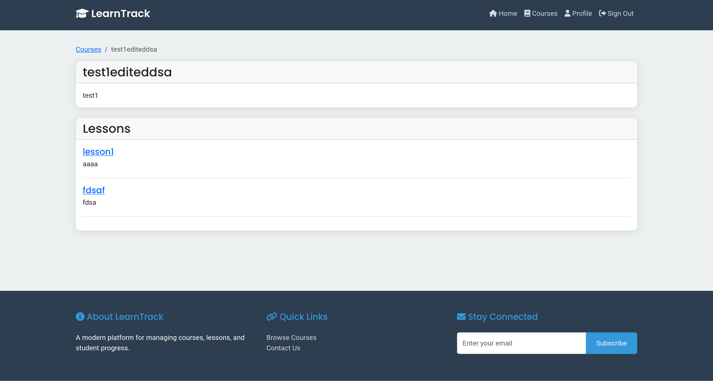
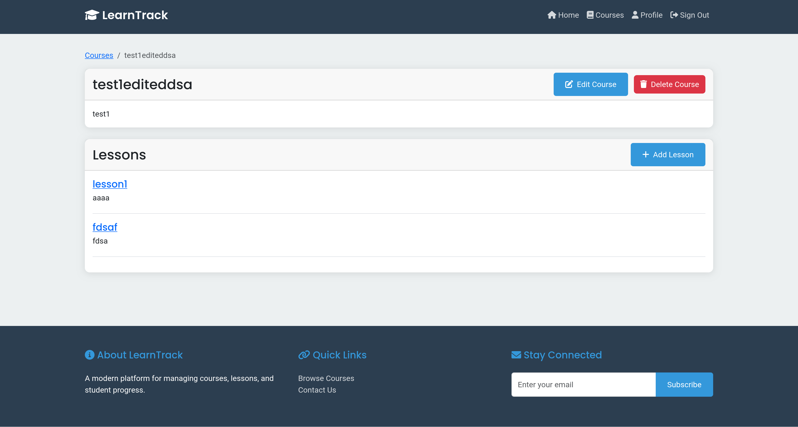

Project created for KTU "T120B165 Saityno taikomųjų programų projektavimas" module

# LearnTrack

LearnTrack is a simple system designed for managing courses, lessons, and reviews. It provides a user-friendly interface for lecturers, students, and administrators to interact with educational content effectively.

## Overview

The LearnTrack platform allows users to create, manage, and review courses and lessons. It is built using modern web technologies, ensuring a responsive and engaging user experience. The application is structured to support various user roles, including lecturers, students, and administrators, each with specific permissions and functionalities.

## Functional Requirements

### Course Management

- **Lecturers** can create, edit, and remove their courses.
- **All Users** can view available courses.

### Lesson Management

- **Lecturers** can create, edit, and delete lessons for their courses.
- **All Users** can view available lesson in a course.

### Review Management

- **All Users** can view and create reviews for lessons.
- **User** can edit and delete their reviews.

## Used Technologies

- **Front-end**: SpringBoot WebFlux, ThymeLeaf, Bootstrap, Google Fonts (Roboto), Font Awesome icons
- **Back-end**: Java (Spring boot) Authorization and Resource server implementing OAuth2
- **Database**: PostgreSQL

## Front-end pages

### Common views

Common views consist of pages that are available to all users, no matter their role.

#### Login page

The login page consists of a simple usernam and password field in the Authorization server. You are brought here by the Client Server to sign-in with OAuth2. Then a callback is initialized back to the Client server where the user data is processed, and information is requested from the Resource server, which accepts the JWT token minted by the Authorization server.

#### Home page

Home page consists of a really simple dashboard, which only shows three working things:

1. Available (created) courses
2. "Browse Courses" link button, which takes to the courses list page
3. Navigation bar.

Other dashboard functions are not implemented as this was not needed for this task.

#### Review creation modal form

This is how a review creation modal form looks like. This initiates a POST action to the Client server, which then uses the JWT token to initiate a request to the Resource server and awaits a response from it on the success of the request,.

#### Log out page

### User view

User view pages consists of pages, that show how a specific role sees those pages.

#### Courses list page

For the user, the course list page only displays courses in cards, which are link to those courses. A User can't create Courses.

#### Course information page with lessons list

User only sees the course information, with available lessons in it. User can't create lessons for a course.

#### Lesson information page with reviews list

User only sees the lesson information with reviews left by other users or lecturers. User can create reviews for any lesson, and can only delete their own reviews.

### Lecturer view

These views display how role specific functionality is displayed to the `lecturer` role.

#### Courses list page

Lecturers can create courses in the course list page. This button is only created for Lectureres.

#### Courses creation modal form

This course creation form modal is only seen by the lecturers after pressing the "Add Course" button.

#### Course information page with lessons list

Lecturer sees the options to edit or delete their courses. When "Edit Course" button is clicked, the same course modal form is opened, but this time only with the option to save the edited course information. When clicking "Delete Course" a browser warning pops up clarifying the user about the danger of deleting the course, with the option to cancel this action.

#### Lesson creation modal form

Lesson creation form modal is basically the same one as with the course creation form modal, only that the input field names are different, and the POST request API endpoints are different to.

#### Lesson information page with reviews list

Lectuere can do the same things with a lesson as with the course: editing, and deletion. Both buttons react the same as with the Course's edit and delete buttons.

## OpenAPI specification

You can find the OpenAPI specificiation file at , or visit the `Swagger-ui` page in the [resourses server](https://learntrack-resource-server-qq87t.ondigitalocean.app/swagger-ui/index.html).

## Conclusions

Creating a proper Auth server which supports OAuth2 is a time-consuming task and brings in a lot more problems than it solves, as if you want to use this in a real project, this would cost a lot more than using a third-party solution, because you would need to solves all problems on your own, and hire developers who are skilled at this.

Creating a resource server, which provides all API endpoints and their descriptions would be a lot harder, if OpenAPI didn't exists. With auto-generated OpenAPI specifications file and swagger-ui page generation enabled, it becomes a lot easier to publish the specifications and use them yourself in the Front-End applications.

Either way, this was a useful experience, as by doing these things manually, you actually understand it more in-depth than by simply reading the theory and trying to remember it.
